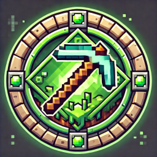

<p align="center"></p>

<h1 align="center">Uzurion Launcher</h1>

[<p align="center">
](https://github.com/luuxis/Uzurion-Launcher/releases) 
[](https://github.com/luuxis/Uzurion-Launcher/releases) 
[](https://github.com/luuxis/Uzurion-Launcher/releases)

</p>


---

**Cloner et installer les dépendances**

```console
> git clone https://github.com/luuxis/Uzurion-Launcher.git
> cd Uzurion-Launcher
(si linux) > sudo apt install -y libatomic1
> npm install
```
---

**Lancer l'application**

```console
> npm start
```
---

**Création du build**

| Platform    | Command              |
| ----------- | -------------------- |
| Windows  | `npm run build:win`   |
| macOS    | `npm run build:mac`   |
| Linux    | `npm run build:linux` |
| All    | `npm run build:all` |

---

**<p align="center">Fonctionnalité du launcher.</p>**

- Mise à jour automatique.

- Maintenance launcher.

- Maintenance message custom.

- Statut serveur complet.

- Authentification mojang.

- Authentification Microsoft.

- Authentification crack.

- Accepte toutes versions de Minecraft 1.0 > 1.18.x (Forge, Fabric etc).

---
**<p align="center">Configurer votre launcher.</p>**

- Il vous faudra un serveur web, avec PHP tournant sur Apache ou autre.

- Il vous faudra télécharger et extraire l'archive [web-folder](https://github.com/luuxis/Uzurion-Launcher/archive/refs/heads/WEB-Folder.zip).

- Rendez-vous dans le dossier `launcher/config-launcher` et ouvrez le fichier `config.json` et faites vos config.

---

[<p align="center">](https://discord.gg/e9q7Yr2cuQ) 
---

[releases]: https://github.com/luuxis/Uzurione-Launcher/releases 'releases'
[build]: https://github.com/luuxis/Uzurion-Launcher/releases 'build'


