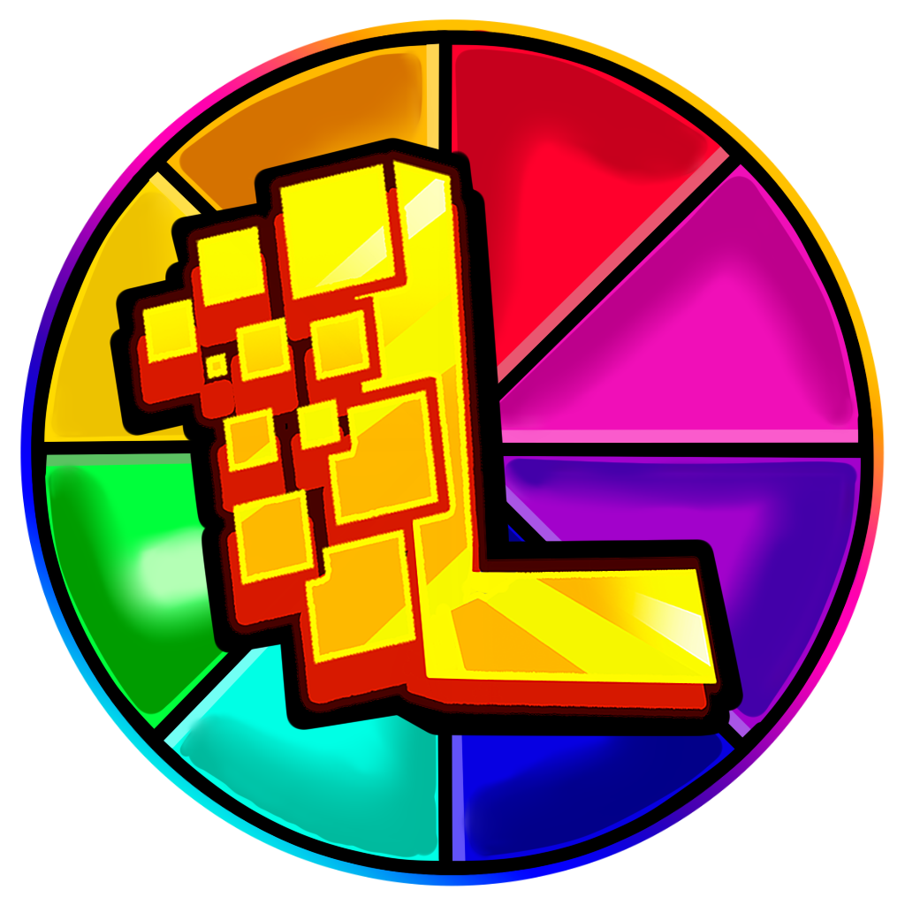

<h1 align="center">CraftLaunch</h1>

[
]()

[
]()

    

---
### **<ins>
Conditions d'utilisation:
**
- Pour utiliser le code vous devez faire un fork du projet.
- Pour utiliser le code votre code doit tout le temps être public.
- Pour utiliser le code toute mention originale de la licence doit être gardé.
- Pour utiliser le code vous devez garder la licence originale.
---

### **<ins>
Fonctionnalitées du launcher :
**

- ✅ Mise à jour automatiques via github.

- 🔴 Option pour mettre le launcher en maintenance.

- 🔒 Authentification Microsoft.

- ⛏️ Supporte toutes versions de Minecraft 1.0 > latest.

- 📦 Supporte les version moddées Forge, NeoForge, LegacyFabric, FabricMC et Quilt

- 📰 Fil d'actualité intégré nativement au launcher.

- ⚙️ Gestion intuitive des paramètres, y compris un panneau de configuration Java.

- 🟢 Statut serveur complet.

    - Opérationnel ou hors ligne.
    
    - Nombres de joueurs connectés.

- ☕ Installation de Java automatique.

    - Si vous avez installé une version incompatible de Java, nous installerons la bonne pour vous.
    
    - Vous n'avez pas besoin d'avoir Java installé pour exécuter le launcher.

Ce n'est pas une liste exhaustive. Installez le launcher pour voir tout ce qu'il peut faire !

Vous aimez le projet ? Laissez une étoile ⭐ sur le repo !

---

### **<ins>
Téléchargement :
**

Vous pouvez télécharger le launcher à partir des [Releases GitHub](../../../releases).

Plateformes supportées :

- Windows 
- Linux
- MacOS

Si vous téléchargez à partir des Releases, sélectionnez le programme d'installation de votre système.

 Plateforme | Fichier |
| -------- | ---- |
| Windows x64 | `Selvania-Launcher-win-x64.exe ` |
| macOS x64 | `Selvania-Launcher-mac-x64.dmg` |
| macOS arm64 | `Selvania-Launcher-mac-arm64.dmg` |
| Linux x64 | `Selvania-Launcher-linux-x86_64.AppImage` |

---