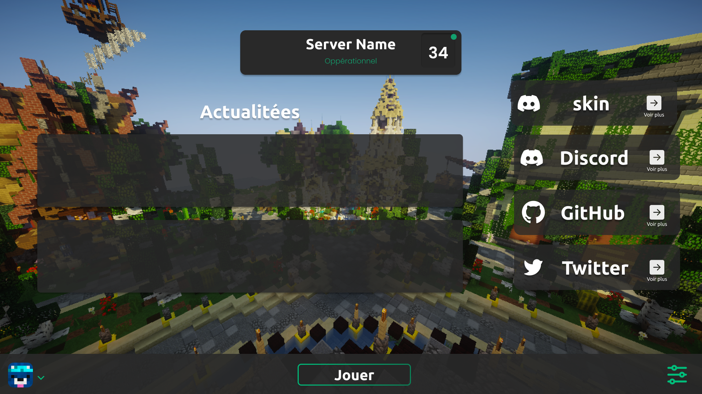
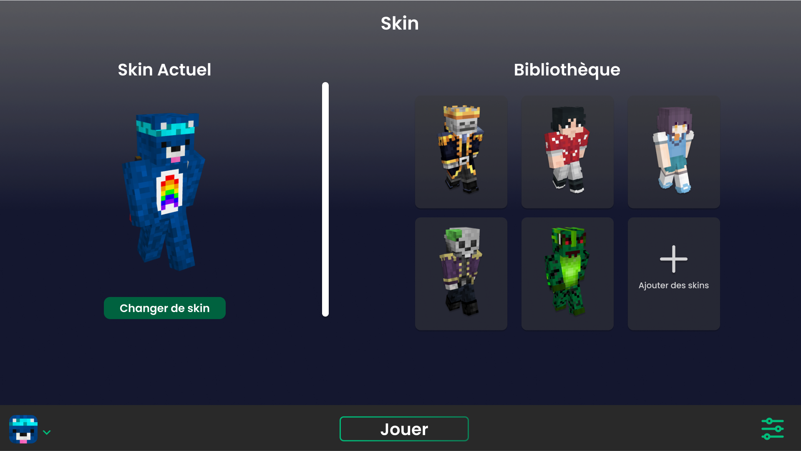
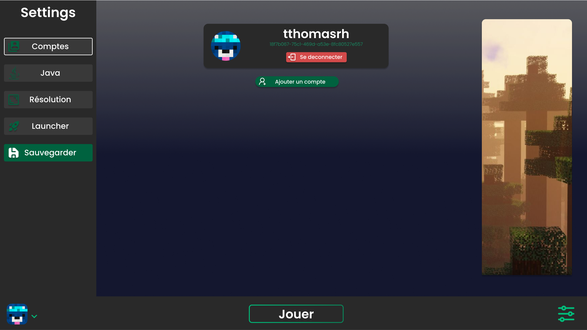
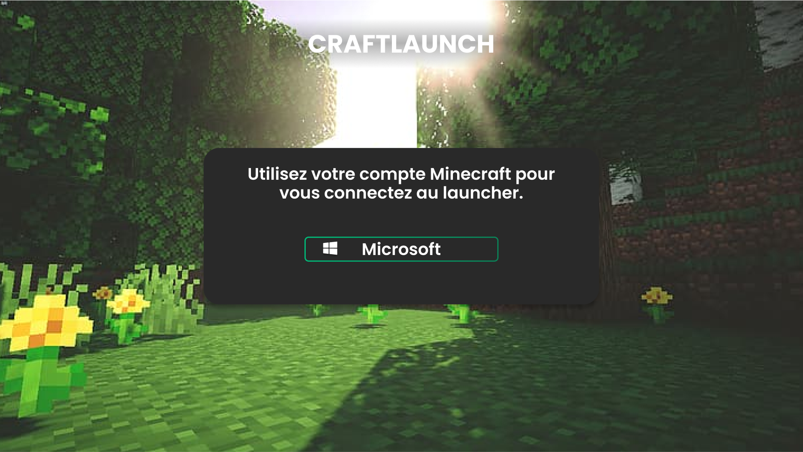

<h1 align="center">CraftLaunch</h1>

#### [
]() *(A powerful and efficient minecraft launcher based on electron)*
[
]()

[
]()

#### *
Return to the original documentation by clicking [Here](README.md).
*

---
### **<ins>
Terms of use :
**
- To use the code you must fork the project
- To use the code your code must always be public

---

### **<ins>
Screenshots :
**

 *Main page*

&nbsp;

 *Skin management page*

&nbsp;

 *Account management page*

&nbsp;

 *Login page*

---

### **<ins>
Launcher features:
**

- ✅ Automatic updates via github.

- 🔴 Option to put the launcher under maintenance.

- 🔒 Microsoft Authentication.

- 🏴‍☠️ Crack Authentication.

- ⛏️ Supports all versions of Minecraft 1.0 > 1.19.x (Forge, Fabric etc).

- 📦 Supports Forge and Fabric modded versions (Not MCPs)
 
- 📰 News feed natively integrated into the launcher.

- 🚹 Skin manager.

- ⚙️ Intuitive settings management, including a Java control panel.

- 🟢 Full server status.

     - Operational or offline.
    
     - Number of connected players.

- ☕ Automatic Java installation.

     - If you have installed an incompatible version of Java, we will install the correct one for you.
    
     - You don't need to have Java installed to run the launcher.

This is not an exhaustive list. Install the launcher to see all it can do!

Do you like the project? Leave a ⭐ star on the repository!

---

### **<ins>
Vdo you need help making your own launcher? :
**

- Here is the [Wiki](./wiki_EN-US.md) specially written to guide you step by step in creating your launcher.

---
### **<ins>
Download:
**

You can download the launcher from [GitHub Releases](https://github.com/luuxis/Selvania-Launcher/releases).

Supported platforms:

- Windows 
- Linux
- MacOS

If you are downloading from Releases, select the installer for your system.

 Platforme | Fichier |
| -------- | ---- |
| Windows x64 | `Selvania-Launcher-win-x64.exe ` |
| macOS x64 | `Selvania-Launcher-mac-x64.dmg` |
| macOS arm64 | `Selvania-Launcher-mac-arm64.dmg` |
| Linux x64 | `Selvania-Launcher-linux-x86_64.AppImage` |

---

 

If you like this project and want to help develop it, you can donate to us on [Paypal](https://www.paypal.me/luuxiss).

If you have any questions, problems or suggestions, feel free to join our discord:

 

[
](https://discord.gg/e9q7Yr2cuQ) 
---

 
 

[
]() *Readme by [@Fefe_du_973](https://github.com/Fefedu973)*  
