# Launcher User Guide

## 1. installation

___

### 1.1. Prerequisites

#### - To start it is imperative to make a fork of the project. **If you don't do it you will not respect the terms of use.**

#### - You need to install the following software to start editing the launcher:

- [Github Desktop](https://desktop.github.com/)
- [Visual Studio Code](https://code.visualstudio.com/)
- [Node.js](https://nodejs.org/) **⚠️ Take the LTS version**

#### - A working apache and php web server ⚠️ **Required to start the launcher**

___

### 1.2 Fork the project:

To begin you must make a fork of the project to do this go [here](https://github.com/luuxis/Selvania-Launcher).

- Then click on "Fork" :

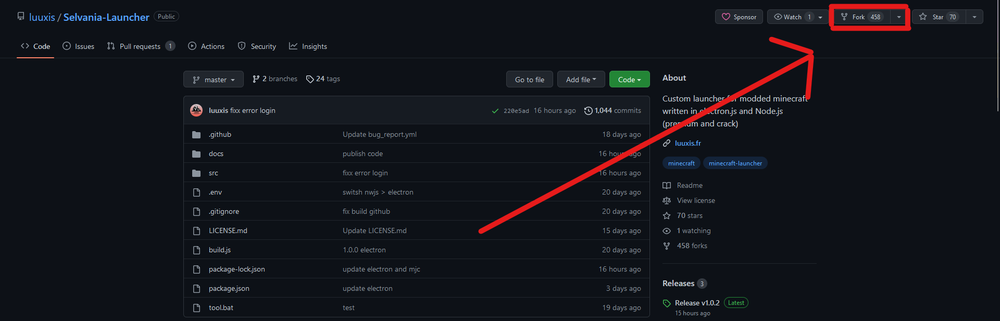

- Enter the desired information and click on "Create fork" and uncheck "copy master branch only" :

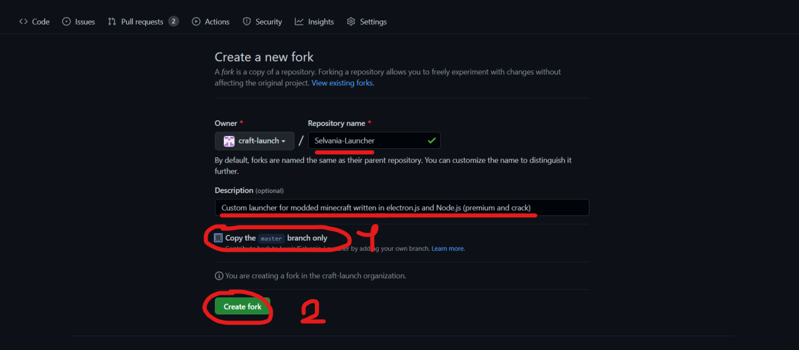

___

### 1.3. Make a clone : 

#### **⚠️ Please log in to your github account on github desktop before proceeding!** To do this click on the following button:

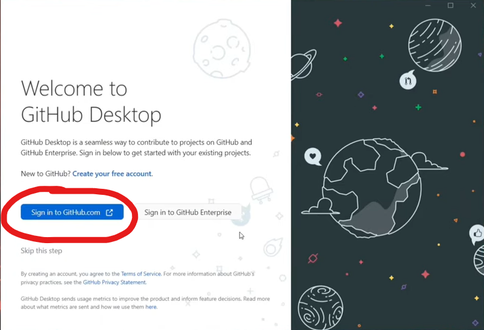

- You should arrive on this page which should open your browser to connect you automatically once the operation is finished click on "finish":

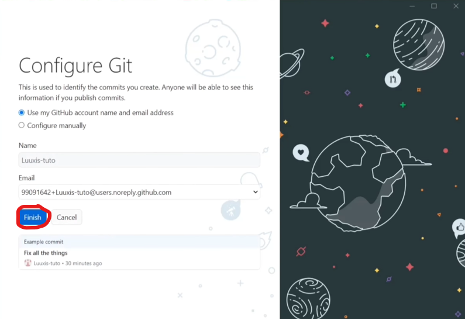

- Once connected you should see this page Click on your fork which should appear on the list on the right then click on "clone" :

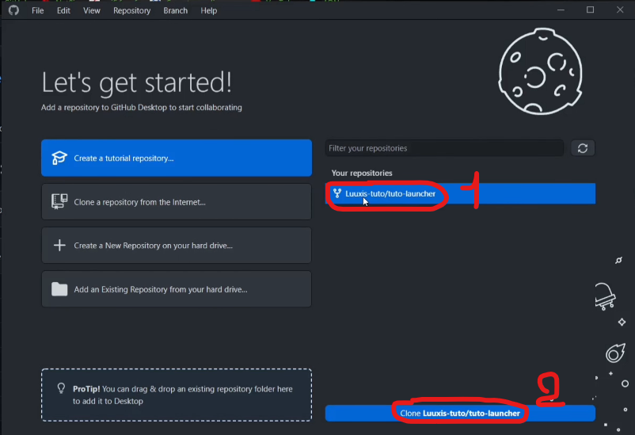

- Choose well the place where you want to put the project on your computer and click on "Clone" :

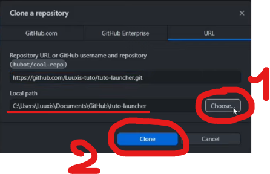

- Wait a few seconds while the project is downloaded to your computer.

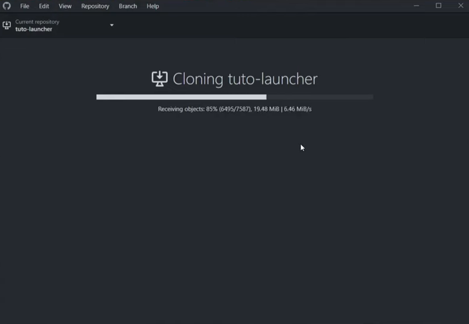

- Once the project is downloaded, click on "For my own purposes" and then on "Continue" :

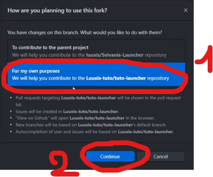

- Finally click on "Open in Visual Studio Code" :

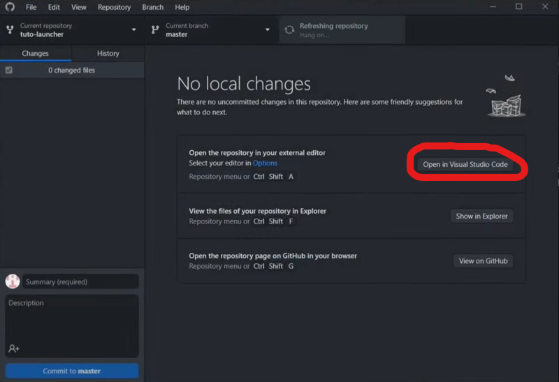

- Now you can start editing the launcher!

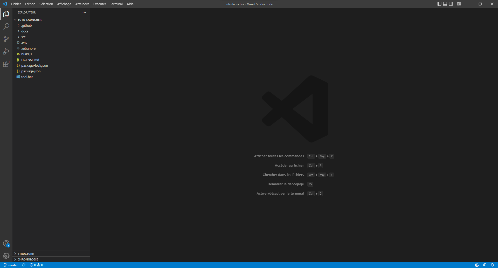

___
## 2. Environment

### 2.1. Setting up the terminal

- To continue we will open the terminal to do this click on "Terminal" -> "New terminal" :

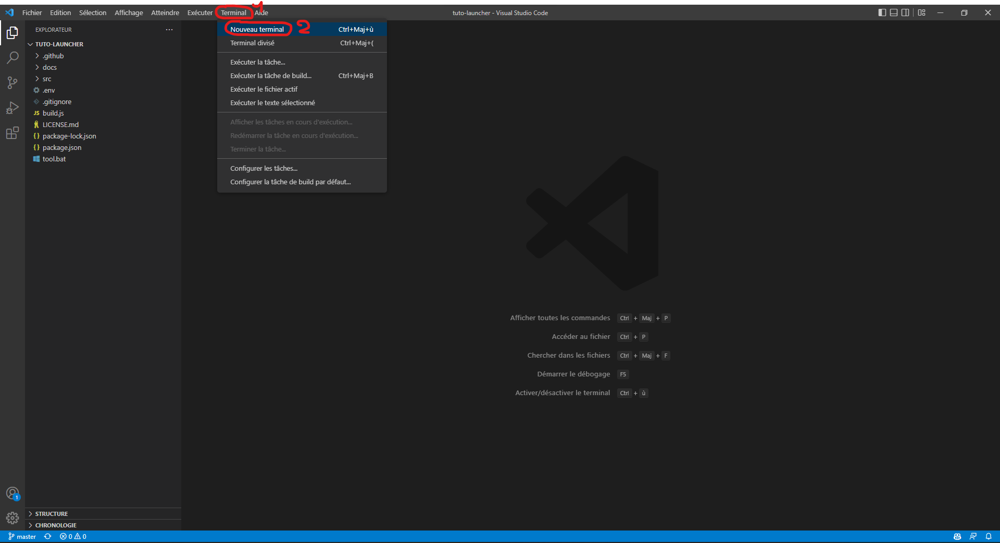

- Once the terminal is open, click on the small arrow next to the + and then on "Select default profile":

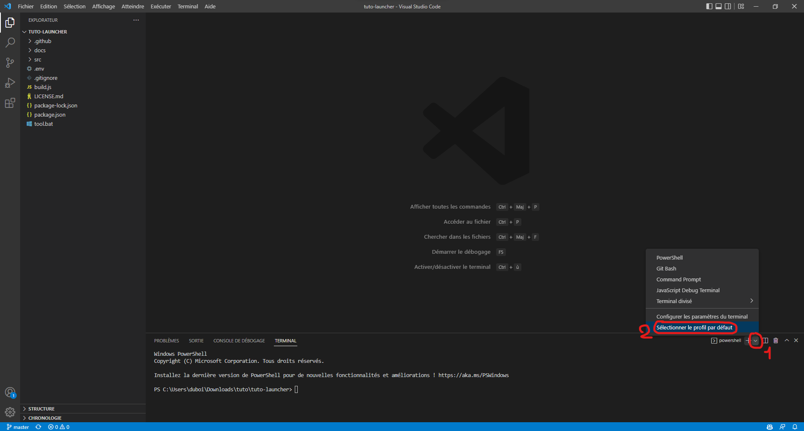

- A window opens, click on "Command Prompt" :

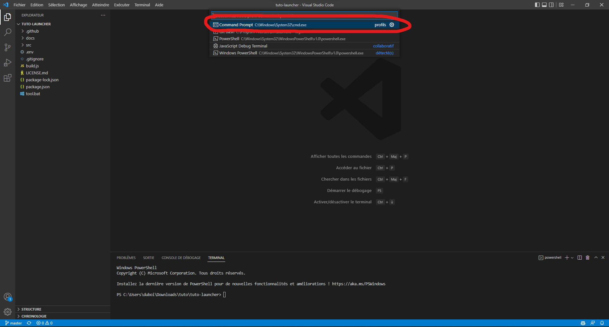

___

### 2.2 Installation of the last modules

- Once the terminal is open, you need to install the project modules. To do this, run the following command:

```console
  npm install // Installing the modules
```

- To check that everything is working properly, run the following command:

```console
  npm start // Run the launcher (please make sure the launcher is running) 
```

- For your information: Here are the available commands
```console
  npm run dev // Start the development version of the launcher
  npm start // Start the launcher
```
___
### 2.3. Details

- If you know a little bit about it, you're probably wondering "why didn't they put npm run build in the available commands?" It's simple, to compile the launcher you have to go through github (we'll explain the procedure below in the documentation).

- I advise you to activate the automatic saving to do this click on "File" -> "Automatic saving" by running npm run dev this will have the effect of restarting the launcher at each modification to check if what you have done works and it will also avoid losing the modifications if visual studio crashes for example.

___
## 3. The web server

So that the launcher can function it is necessary to set up a functional web server under apache and php.

This step is important because it is essential for the launcher to work.
To do this you must have either a machine at home that runs 24/24 to host the web server, or a dedicated server (a server that you rent from a host).
___

## ⚠️ ATTENTION!
**This part is complicated we advise you to know what you are doing before continuing!**

**If you don't have the necessary skills to set up the web server and configure it or if you don't have a machine at hand that can run 24 hours a day to host your web server we advise you to use the easy and turnkey solution of luuxis specially made for the launcher more information [here](https://dev.luuxis.fr/) .**

Before continuing we will consider that : 

- You have a local or remote server under windows or linux
- That you know how to connect with ssh to your server
- That you know the local and public IP address of your server
- That you know how to do a port forwarding on your server
- That you know how to put files on your server

If you don't have / don't know how to do any of the above we invite you to search the internet. No support will be provided for this.

___
### 3.1 Installing the web server under linux

#### 3.1.1. Prerequisites

To follow this guide, you need the following things:
- A linux server (ubuntu, debian, etc.)
- Have direct or ssh access to your server
___
#### 3.1.2 Installing Apache

- Connect with SSH to your server, then update your packages.

```console
$ sudo apt update && sudo apt -y upgrade              # Debian/Ubuntu/Linux Mint

$ sudo dnf -y update                                  # Fedora

$ sudo pacman -Syu                                    # Arch Linux
```

- Next, run the command below to install the Apache web server.

```console
$ sudo apt install -y apache2                         # Debian/Ubuntu/Linux Mint

$ sudo dnf install httpd-manual                       # Fedora

$ sudo pacman -S apache                               # Arch Linux
```

- Visit the URL below in a web browser and replace 192.0.0.1 with the IP address of your server. (we assume your server is local if not you must enter the IP address of your remote server which you should already know)
```console
http://192.0.0.1/
```

You should see the default Apache web page as shown below. Congratulations! You have successfully installed Apache!

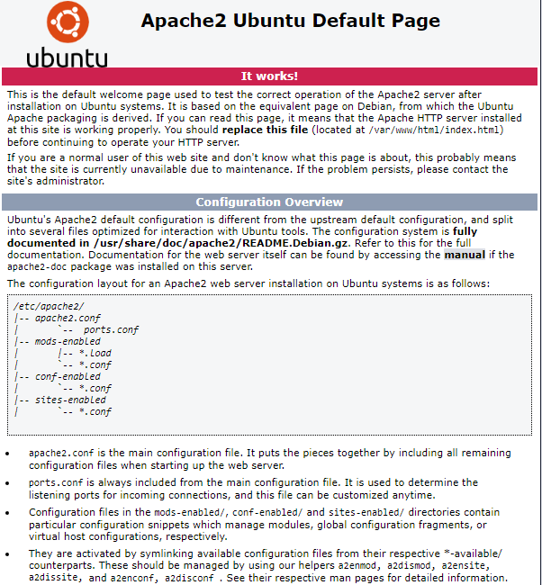

After configuring the web server we will need to install PHP.
___
#### 3.1.3 Installing PHP

- In this step you will install the PHP package. To do this run the command below.

```console
$ udo apt install -y php                              # Debian/Ubuntu/Linux Mint

$ sudo dnf install php                                # Fedora

$ sudo pacman -S php                                  # Arch Linux
```

- Restart the Apache web server to load PHP.

```console
$ sudo systemctl restart apache2                      # Debian/Ubuntu

$ sudo /etc/init.d/apache2 restart                    # Linux Mint

$ sudo systemctl restart httpd.service                # Fedora

$ sudo systemctl restart httpd                        # Arch Linux
```
- You can always verify that apache is running by checking its status by running the command below. (ctrl + c to exit)


```console
$ sudo systemctl status apache2                       # Debian/Ubuntu/Linux Mint

$ sudo systemctl status httpd.service                 # Fedora

$ systemctl status httpd                              # Arch Linux
```

- To test PHP, create an info.php file in the root directory of your web server.

```console
$ sudo nano /var/www/html/info.php                    # Debian/Ubuntu/Linux Mint

$ sudo dnf -y install nano                            # Fedora/Arch Linux
$ sudo nano /var/www/html/info.php                    # Fedora/Arch Linux
```

- Then enter the following information in the file.

```php
<?php
phpinfo();
?>
```
- Save and close the file by pressing CTRL + X, then Y and ENTER. Next, in a web browser, Visit the URL below on a web browser and replace 192.0.0.1 with the IP address of your server. (we assume your server is local if not you must enter the IP address of your remote server which you should already know)

```console
http://192.0.0.1/info.php
```	

You should get a detailed PHP page as shown below.

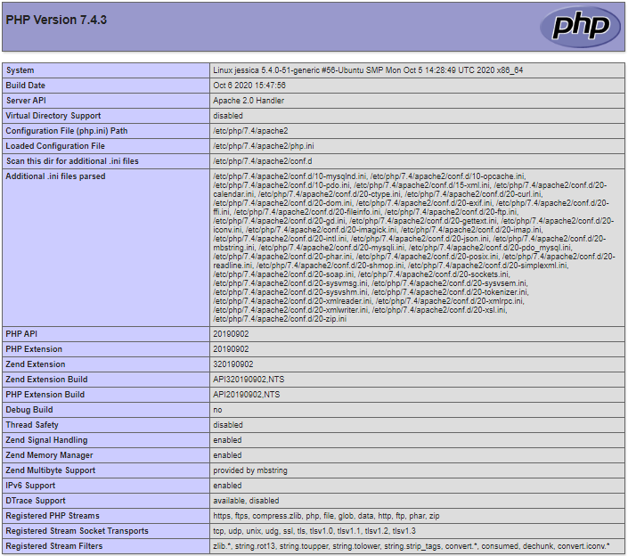

Congratulations ! You have successfully installed PHP!
___

### 3.2 Installing the web server under Windows

#### 3.2.1. Prerequisites

To follow this guide, you need the following things:
- A server / computer running Windows (Windows 11, Windows 10, etc.)
- Have direct or remote access to your server/computer

___
#### 3.2.2 Installing Apache

The first obstacle to installing Apache on Windows is that you cannot download the installation binaries directly from apache.org. You have to clone and compile the Apache HTTP Server source code yourself or download the Apache 2.4 installation media from a third party.

- A third party download of the binaries is certainly the easiest way to go. That's why I invite you to go to [apachelounge.org](https://www.apachelounge.com/download/) and click on the circled link below (2) to download the Apache 2.4 installation media.
You also need to download Visual C++ Redistributable Visual Studio 2015-2022 for that click on the link circled in red (1). Install Visual C++ Redistributable Visual Studio 2015-2022 for that run the downloaded program, accept the terms of use and click the Install button. Windows will ask you for the administrator permissions and click on the OK button.

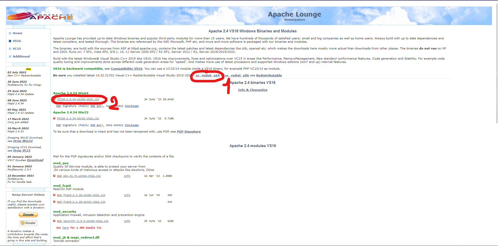
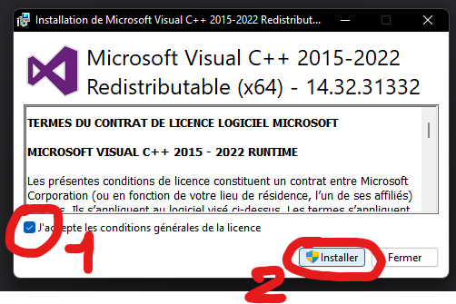

- To start please extract the downloaded zip file.
- Move the Apache24 folder to the root directory ("C:\") of your computer.
- Go to the directory "C:\Apache24\conf" and open the file "httpd.conf".
- Look for (ctrl + f) the following line: "#ServerName www.example.com:80"
- Remove the # and save the file.
- Do Win + r and enter this "C:\Windows\System32\systempropertiesadvanced.exe" and click on enter.
- Click on "Environment Variable..." and select "Path" click on "modify" then click on "New" and enter "C:\Apache24\bin" and click on OK.
- Restart your computer.
- Open the command prompt (windows + R) and enter cmd then click on Ctrl + Shift + enter windows will ask you for the administrator rights click on "Ok".
- Enter the following commands:

```console
> path                                                # A lot of things will be displayed, these are the environment variables, if you see "C:Apache24bin" you have done the previous step.
> httpd -k install                                    # Installing the Apache web server
> httpd -k start                                      # Starting the Apache web server
```
If errors appear, try to correct them by searching the internet. To verify that Apache is working properly, press Ctrl + shift + escape and go to the services tab and you should see Apache 2.4

- Go to http://localhost:80 to check the installation.
- If you see "It works!" it means that Apache is installed and working.

___


#### 1.2.3 Installing PHP

- To install PHP go to [https://windows.php.net/download/](https://windows.php.net/download/)
- Click on the link "Zip" Thread safe to download the zip file
- To start please extract the downloaded zip file.
- One extract rename the folder to "php".
- Move the "php" folder to the root directory ("C:\") of your computer.
- Make Win + r and enter this "C:\Windows\System32\systempropertiesadvanced.exe" and click on enter.
- Click on "Environment Variable..." and select "Path" click on "modify" then click on "New" and enter "C:\php" and click on OK.
- Restart your computer.
- Enter the following commands:

```console
> path                                                # A lot of things will show up that are environment variables if you see "C:\php" then you did the previous step.
> php -v                                              # Check the PHP version
```
If php -v works you have installed PHP. Now you have to connect php with Apache.

- Go to the directory "C:Apache24" and open the file "httpd.conf".
- Go to the end of the document and add the following links:

```console
LoadModule php_module "C:\php\php8apache2_4.dll"
AddHandler application/x-httpd-php .php
PHPIniDir "C:\php"
```

- Save the file.
- Go to the directory "C:\php" you will see two files "php.ini-development" and "php.ini-production".
- Copy and paste the file "php.ini-development" in the "C:\php" directory
- Rename the file "php - Copy.ini-development" to "php.ini".
- Open the command prompt (windows + R) and enter cmd then click on Ctrl + Shift + enter windows will ask you for the administrator rights click on "Ok".
- Enter the following commands:

```console
> httpd -t                                            # Check the Apache web server configuration. If you see "Syntax OK" then you have configured Apache correctly. If not there is a problem in your configuration. Look for the error on the internet and correct it.
> httpd -k restart                                    # Restarting the Apache web server
```
- To verify that apache is running properly do Ctrl + shift + escape and go to the services tab you should see apache 2.4

- Go to the directory "C:Apache24" (this is the directory where your site files are located) and create a file "info.php" with the following content:

```php
<?php
phpinfo( );
?>
```

- Save the file and go to http://localhost:80/info.php to verify the installation.

- You should see a page like this:


___
### 3.3. Setting up the launcher backend

Now that the web server is installed and functional, we must now install the launcher backend. To do this, go to the [the web branch of the project](https://github.com/luuxis/Selvania-Launcher/tree/WEB-Folder). 

- Click on the "Code" button and on "Download ZIP".
- Once the zip file is downloaded, extract the zip file.
- Move the folders / files "files", "launcher" and ".htaccess" in the directory "C:\Apache24\htdocs" for windows and in the directory "/var/www/html/" for linux.
- Here is the expected result after having set up the web server and having accessed your site (either localhost or the IP address of your server):

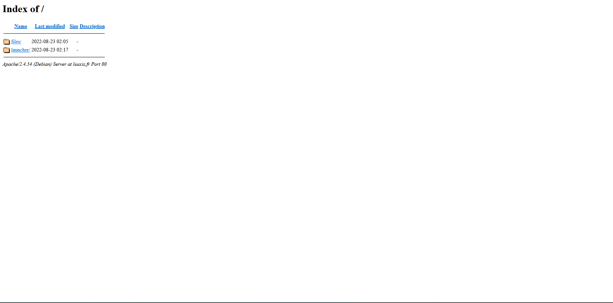

From the file located in the web folder /launcher/config-launcher/config.json you will be able to manage several launcher parameters.

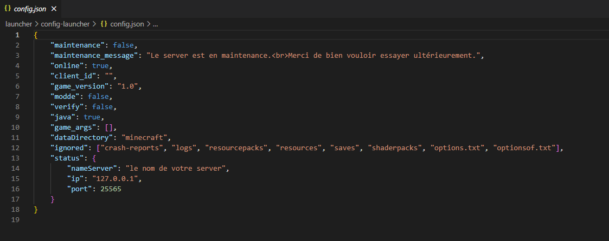

- maintenance: `true/false` This option allows you to disable the launcher for everyone in case of maintenance.
- maintenance_message : `Sorry the launcher is under maintenance` This option allows to define the message that will be displayed to the users of the launcher when it is under maintenance.
- online : `true/false` This option allows to allow or not the cracked accounts to connect to the launcher.
- client_id : This option allows to define the client id of the microsoft account
- game_version : `1.19.2` This option defines the version of the game that the launcher will use to start minecraft.
- modde : `true/false` This option if activated allows to download the game files present on the server on the user's pc mandatory to propose a modded game from the launcher.
- verify : `true/false` This option tells the launcher if it must verify that no game file has been added, deleted or modified compared to the files present on the server if yes it will re-download the game can be used as a pseudo anti-cheat
- java : `true/false` indicates if the launcher must download java from mojang servers, useful to make sure that launcher users have a compatible java **Recommended**
- game_args : add additional custom arguments to launch the game
- dataDirectory: `Minecraft` This option allows you to define the directory where your game will download. Do not put a dot, it will be added automatically if needed.
- ignored: `logs` This option allows you to white-list the files that will not be verified by "verify".
- status: This section allows you to define which server will be displayed in the launcher.
- nameserver: `Craftlaunch Server` This option allows you to set the server name that will be displayed in the launcher.
- ip: `123.546.789` This option sets the IP address of the server that will be displayed in the launcher.
- port: `25565` This option allows you to set the port of the server that will be displayed in the launcher.

Once the configuration on the web server side done, you have to configure the launcher to indicate the URL where to fetch the files on the web server. To do this change the url underlined below in the file package.json by the URL of your web server.

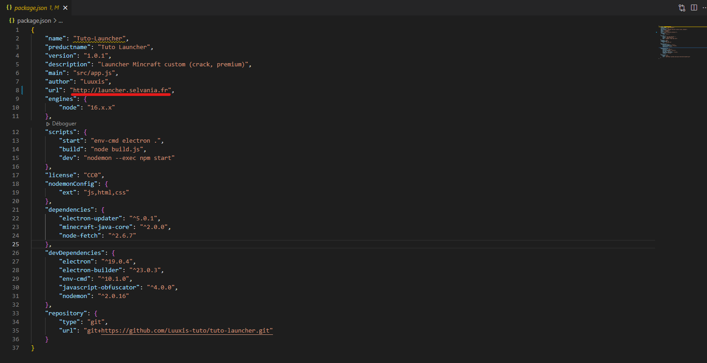

___
### 3.4. Start-up

Well done! If you have reached this point, you have installed and configured everything you need to be able to modify and use the launcher.

At this stage you should be able to run the launcher locally to check that your installation is working.
From a terminal you can type the following command if the launcher launches well with the parameters entered on the web server then all is good:

```console
npm run dev
  ```

If you want to modify the launcher, change the images, texts, etc. you can now do it!
Note that the launcher is a web application so you need to have some basic HTML/CSS skills to modify the look and feel, and some Javascript skills to modify the functionality.

___
## 4. Compiling

### 4.1. Preparation

- Before compiling the launcher we will finish customizing the launcher. To do this go to the package.json file.

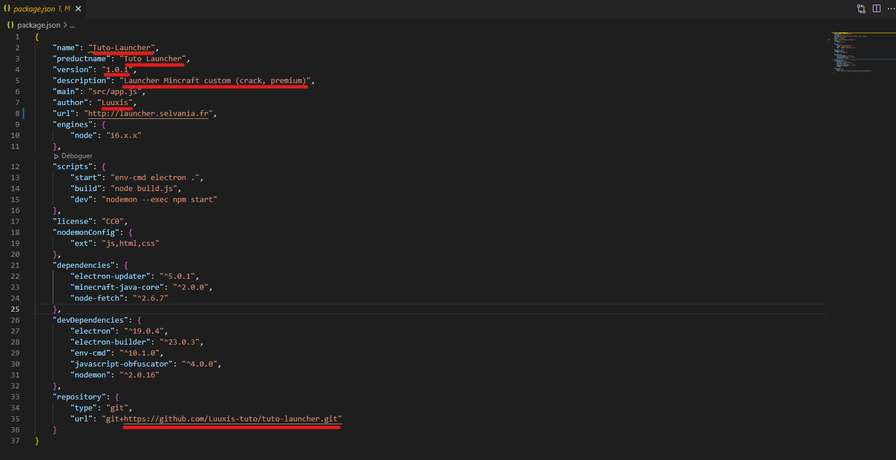

You can modify the underlined parameters:
- "name" : name of the launcher
- "productName" : name of the launcher
- "version" : version of the launcher (⚠️ To compile the launcher you need to put a version higher than the highest tag of the project on GitHub. Please choose a tag format without "v" and with 3 digits (e.g. "1.0.0") for more clarification
- "description" : description of the game
- "author" : author of the game
- url : link of the github (⚠️ Mandatory for the auto update)

Here is the procedure to retrieve the highest tag from the GitHub project:

- Go to the GitHub project
- Go to the actions tab and click on the big green button

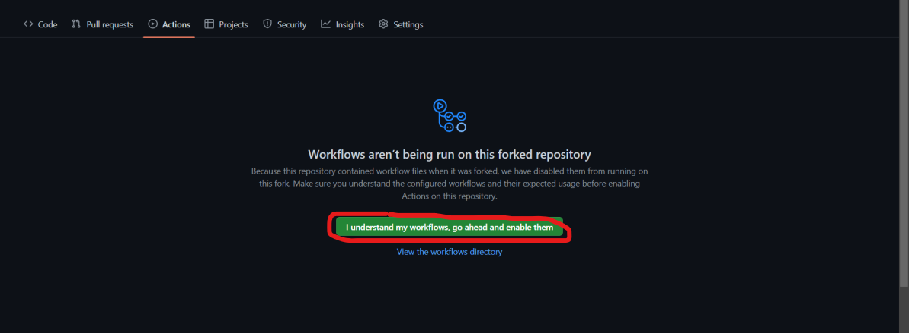

- Click on the "Master" button
- Click on the "tag" button
- Click on the "View all tags" button

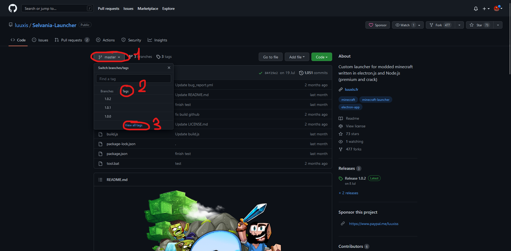

From this menu you can see all the tags of the GitHub project. Find the highest tag and enter a higher number in the "version" variable of the package.json file.

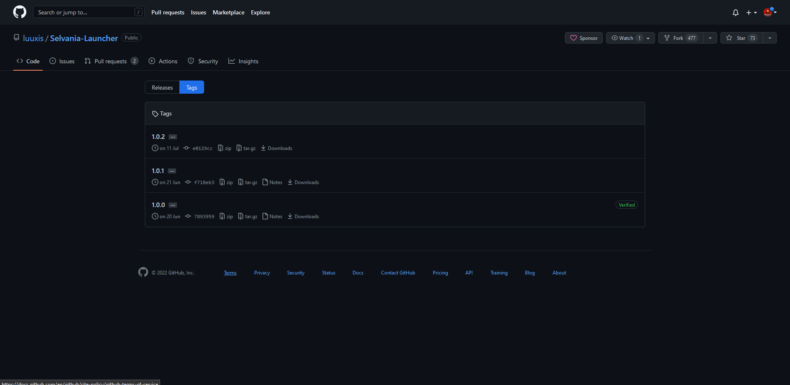

Here is the procedure to get the link to put in the "url" variable of the package.json file:

- Go to the GitHub project
- Click on the "Code" button
- Copy the link at the top of the dropdown menu (see image below)

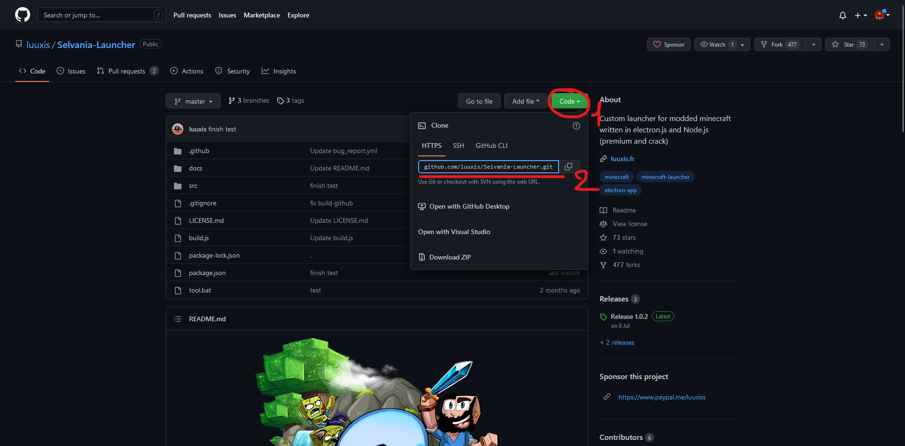
___
### 4.2. Compiling

- Go to the GitHub project
- Click on release

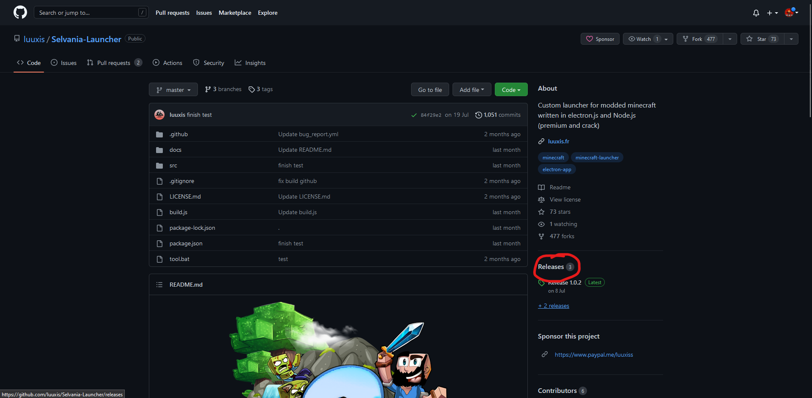

- Click on "Draft a New release

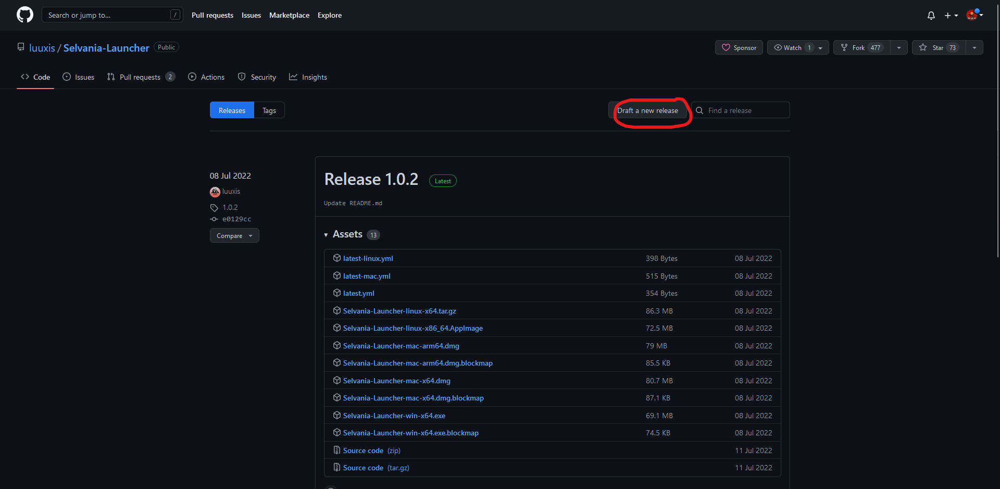

- Click on "Choose tag" then enter **the same tag** as the one entered in the package.json file then click on "Create new tag" !

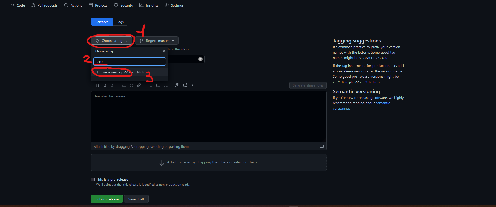

- Fill in the other titles then click on "Save draft" !

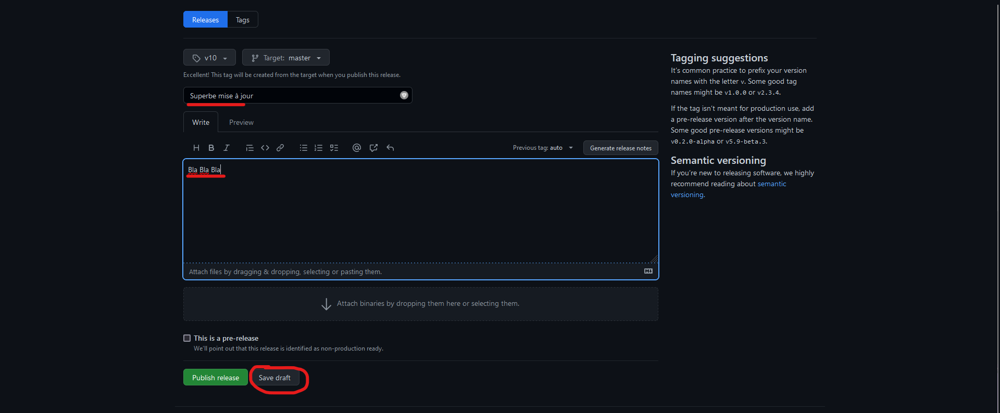

- Open Github Desktop

- In the left list (see screenshot below) you can see the modified files. To upload the files to github enter a description for the update in the underlined field and click on "Commit to main".

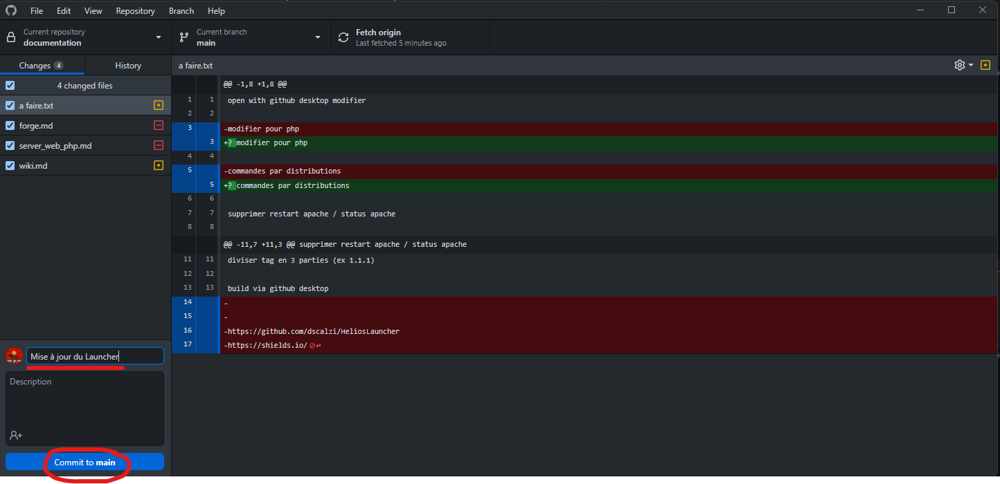

- Once this is done click on "Push origin" !

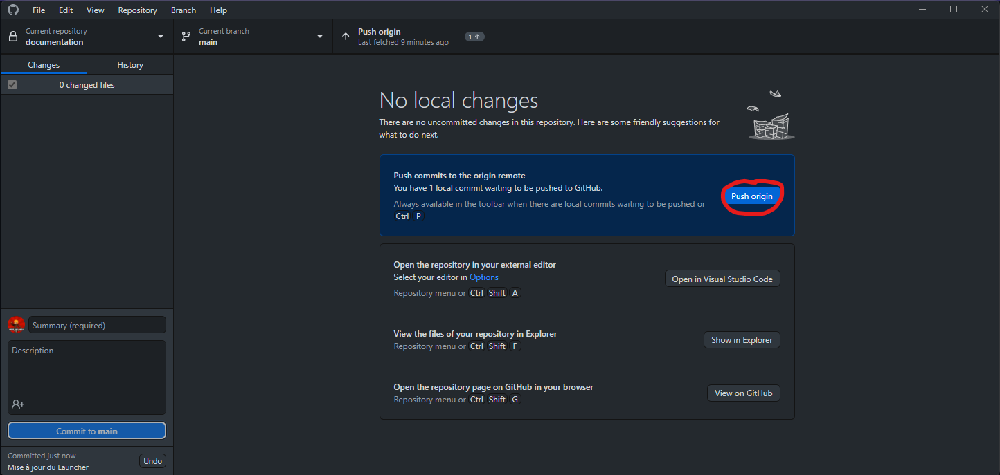

- After pushing the project to github, you should see that it is github that compiles the launcher.

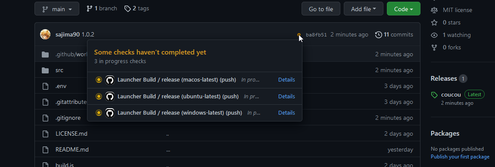
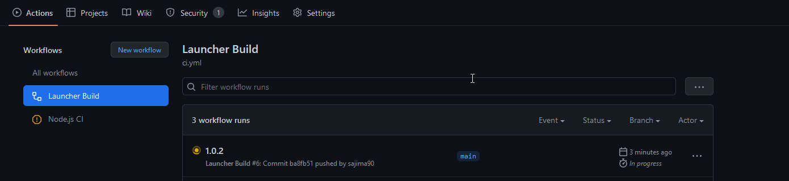

- Wait for the process to finish (the dots will turn green)

- Go to the releases page, find your draft, click on it and click on "Publish release".

Well done! You have finished compiling the launcher. You can now download and install it on your computer from the releases tab.

___
## 5. Faq


### What are the Minecraft verions supported by the launcher?
___
- All versions between 1.0 and 1.19.X are supported.

### Are MCPs supported?
___
- No, the launcher does not support MCPs.

### Does the launcher support autoconnect?
___
- We are against autoconnect so we will not provide support for this feature. It is possible to enable it by modifying the game launch arguments in the config on the web server (game_args).

### Why doesn't the news work?
___

- The news are currently under redevelopment that's why they are not available for the moment. It is possible to activate them : create a folder "news-launcher" in the same directory as "config-launcher" on the web server. Then create a file "news.json" and complete the content of the file with the following information:

```json
[
    {
        "id":"",
        "title":"",
        "content":"",
        "author":"",
        "link": "",
        "publish_date":""
    }
]
```
### How to put forge on the launcher?
___

- Go to the [forge site](https://files.minecraftforge.net/net/minecraftforge/forge/) to download the version of forge corresponding to the version of Minecraft you are using.

- Go to your web server then go to "files/files" (not the folder with a php file but the one below) and create an empty "launcher_profiles.json" file.

- Run the Forge installer and install in the same directory as the "launcher_profiles.json" file while choosing "install client" then click "Ok".

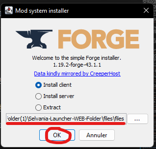

- Well done ! just create a mods folder where you have installed forge (in your web server) to put the mods you want and the files you want.

### How to put fabric on the launcher ?
___

- Go to the [Fabric website](https://fabricmc.net/use/installer/) to download the latest version of Fabric.

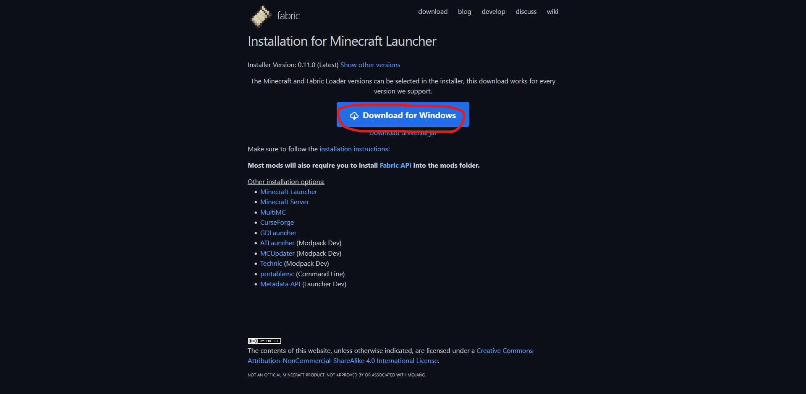

- Go to your web server then go to "files/files" (Not the folder with a php file but the one below) and create an empty "launcher_profiles.json" file.

- Run the Fabric installer and install in the same directory as the "launcher_profiles.json" file while choosing your desired minecraft version then click "Install".

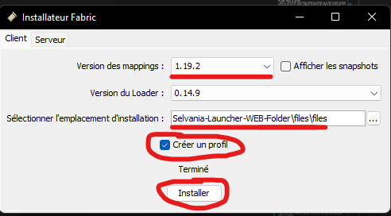

- Well done ! just create a mods folder where you have installed fabric (in your web server) to put the mods you want and the files you want.
___

## To know more :

You can watch the Luuxis videos if you want more details (Only in French)

- [Tuto #1 Create a launch on Minecraft Node.JS (project setup)](https://www.youtube.com/watch?v=0lFKwP0ymsA)

- [Tuto #2 Creating a launch on Minecraft Node.JS (Deepening)](https://www.youtube.com/watch?v=czDgRHznk3Q) 

- Tuto #3 ❌ In progress

How to make a port forwarding ? (Only in French)

- [Open the ports of your box/router easily](https://www.youtube.com/watch?v=qp7Jgj0FSnk&t=132s&ab_channel=Nathol)
___
If you like this project and want to help us develop it, you can make a donation on [Paypal](
https://www.paypal.me/luuxiss)

If you have any questions, problems or suggestions please feel free to join our discord:

<br>

[<p align="center">](https://discord.gg/e9q7Yr2cuQ) 


<br>
<br>

[<p align="center">]() *Wiki by [@Fefe_du_973](https://github.com/Fefedu973)* </p>